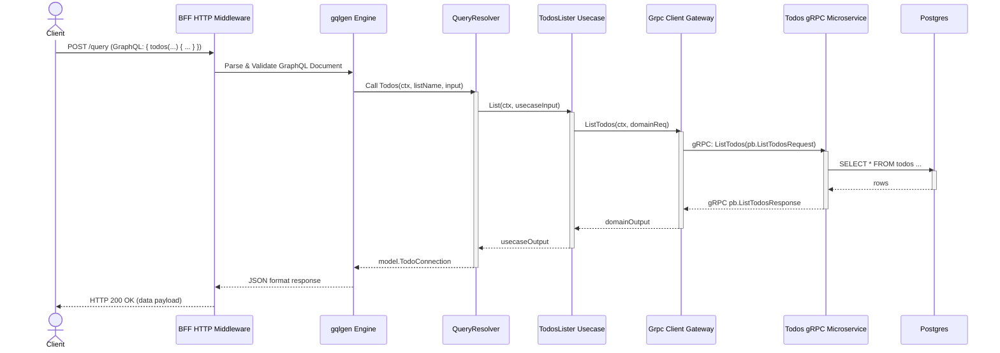

# EX1: Schema Analysis + Trace GraphQL Flow

## 1. Schema Analysis

### Queries

| Name    | Input Types                                          | Return Type        | Applied Directives |
| :------ | :--------------------------------------------------- | :----------------- | :----------------- |
| `todos` | `listName: ResourceName!`, `input: TodosInput`       | `TodoConnection!`  | None               |
| `todo`  | `name: ResourceName!`                                | `Todo!`            | None               |

### Mutations

| Name               | Input Types                                          | Return Type               | Applied Directives                                             |
| :----------------- | :--------------------------------------------------- | :------------------------ | :------------------------------------------------------------- |
| `createTodo`       | `input: CreateTodoInput!`                            | `CreateTodoPayload!`      | None                                                           |
| `deleteTodo`       | `name: ResourceName!`                                | `DeleteTodoPayload!`      | `@hasPermission(permissions: [TODO_DELETE])`, `@validateInput` |
| `updateTodoStatus` | `name: ResourceName!`, `status: TodoStatus!`         | `UpdateTodoStatusPayload!`| None                                                           |

## 2. Trace `todos` Query Flow

1.  **GraphQL Client**: Sends a `todos` query to the BFF.
2.  **HTTP Router & Middleware**: The request goes through HTTP middleware (e.g., CORS, auth, DataLoader initialization) and reaches the GraphQL handler.
3.  **gqlgen Generated Code**: Resolves the root `Query`, parses arguments, and invokes the `Todos` query resolver function in `queryResolver`.
4.  **Resolver (`todo.resolvers.go`)**: 
    - Maps GraphQL/BFF input into the Use Case input layer format.
    - Validates the input structure or domain logic.
    - Calls `TodosLister` (or related `usecase`/`service` layer interface).
    - Maps the output from the Use Case back to the GraphQL `model.TodoConnection` structure and returns it.
5.  **Use Case (`internal/usecase/...` or `internal/service/...`)**: Contains business logic specific to BFF operations. If needed, orchestrates multiple gateway/repo calls.
6.  **Gateway / gRPC Client (`internal/infra/grpc_client/...`)**: The Use Case delegates to an interface implemented by a gateway orchestrating the gRPC connection. The gRPC client marshals the Go request payload into a Protobuf message.
7.  **gRPC Network**: The request is sent over the network to the `todos` microservice.
8.  **Todos Microservice (`todos/cmd/server`)**: 
    - Receives the gRPC call at the API layer (e.g., `TodoHandler`).
    - Propagates downwards via Use Case, Repository, etc.
    - Fetches data from the database.
    - Converts results into Protobuf wire format.
    - Returns the response stream to the BFF.
9.  **Gateway / gRPC Client (BFF)**: Unmarshals the Protobuf response into Go domain entities / output layer objects.
10. **Use Case**: Receives output, maps it as required.
11. **Resolver**: Takes the outcome from the Use Case and completes returning the GraphQL model objects. (Any requested lazy-loading field resolvers like `Creator` are enqueued/processed here or skipped if unrequested).
12. **GraphQL Engine**: Builds the JSON response satisfying the initial query shape.
13. **GraphQL Client**: Receives the `application/json` HTTP response.

## 3. Sequence Diagram

