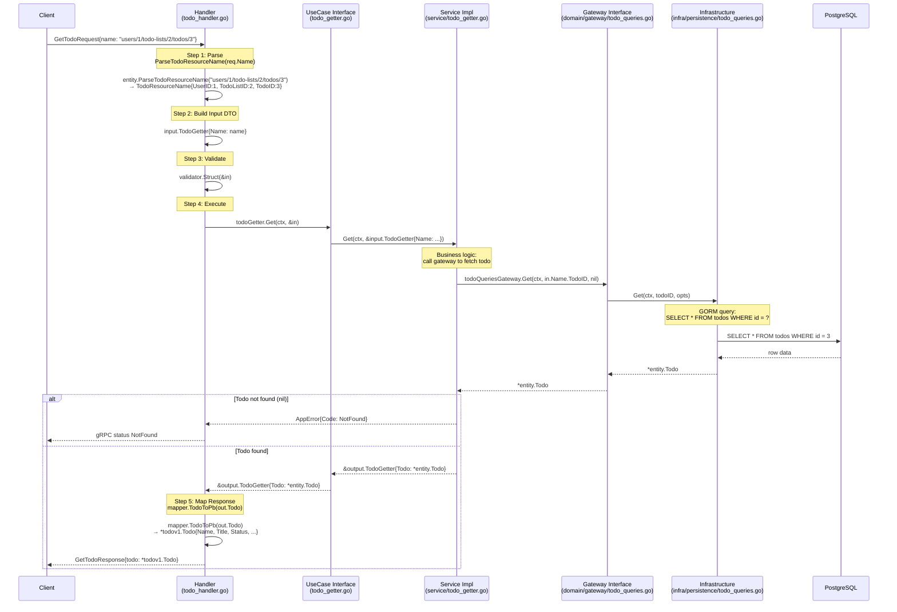

# Exercise 1: Trace Full Request Flow — GetTodo

## Sequence Diagram



---

## Layer-by-Layer Explanation

### 1. Handler Layer — `internal/handler/todo_handler.go`

The entry point for all gRPC calls. It does **no business logic** — its only job is translation and routing.

| Step | What happens |
|------|-------------|
| **Parse** | `entity.ParseTodoResourceName(req.Name)` converts the string `"users/1/todo-lists/2/todos/3"` into a typed `TodoResourceName` struct. Returns `InvalidParameter` if the format is wrong. |
| **Build Input** | Creates `input.TodoGetter{Name: *name}` — a plain DTO that the use case understands, decoupled from proto types. |
| **Validate** | `validator.Struct(&in)` checks field-level constraints (e.g., required fields). |
| **Execute** | Delegates to `usecase.TodoGetter.Get()`. The handler only holds an interface, not the concrete implementation. |
| **Map Response** | `mapper.TodoToPb(out.Todo)` converts the domain `entity.Todo` back to `*todov1.Todo` for the gRPC response. |

Error mapping: `toGRPCError()` converts domain `AppError` codes (NotFound, InvalidParameter, etc.) to the corresponding gRPC status codes (`codes.NotFound`, `codes.InvalidArgument`, etc.).

---

### 2. UseCase Interface — `internal/usecase/todo_getter.go`

Defines **what** the system can do, without specifying **how**.

```go
type TodoGetter interface {
    Get(ctx context.Context, in *input.TodoGetter) (*output.TodoGetter, error)
}
```

- This interface is all the handler knows about. It never imports `service` or `persistence`.
- Enables testing the handler in isolation by mocking this interface.

---

### 3. Service Implementation — `internal/service/todo_getter.go`

Implements the `TodoGetter` interface with the actual business logic.

```go
func (g *todoGetter) Get(ctx context.Context, in *input.TodoGetter) (*output.TodoGetter, error) {
    todo, err := g.todoQueriesGateway.Get(ctx, in.Name.TodoID, nil)
    if err != nil {
        return nil, err
    }
    if todo == nil {
        return nil, apperrors.NewNotFound("todo not found")
    }
    return &output.TodoGetter{Todo: todo}, nil
}
```

- Calls the `TodoQueriesGateway` interface (not a concrete DB implementation).
- If the gateway returns `nil`, it decides the business outcome: return a `NotFound` error.
- Wraps the result in an output DTO.

---

### 4. Gateway Interface — `internal/domain/gateway/todo_queries.go`

Defines the **contract** for reading todo data. Lives in the domain layer, so it has no knowledge of GORM or any database.

```go
type TodoQueriesGateway interface {
    Get(ctx context.Context, todoID entity.TodoID, opts *GetTodoOptions) (*entity.Todo, error)
}
```

- Separates read operations (queries) from write operations (commands) — CQRS-lite pattern.
- The domain layer defines this interface; the infrastructure layer implements it.

---

### 5. Infrastructure Layer — `internal/infra/persistence/todo_queries.go`

The concrete implementation of `TodoQueriesGateway` using GORM and PostgreSQL.

- Receives the `todoID`, runs a SQL query via GORM (`SELECT * FROM todos WHERE id = ?`).
- Maps the database model (`persistence/model/todo.go`) back to the domain entity (`entity.Todo`).
- Returns `nil, nil` when no row is found (the service layer interprets this as NotFound).

This layer is the only place that knows about the database — if the team switches from PostgreSQL to MySQL or another DB, only this layer needs to change.

---

## Summary: Dependency Rule

```
Handler → UseCase Interface → Service → Gateway Interface → Infrastructure → DB
```

Each layer depends only on the layer inside it (toward the domain). The domain layer (`entity`, `gateway interface`) depends on nothing external. This is the **Dependency Inversion Principle** in practice.
